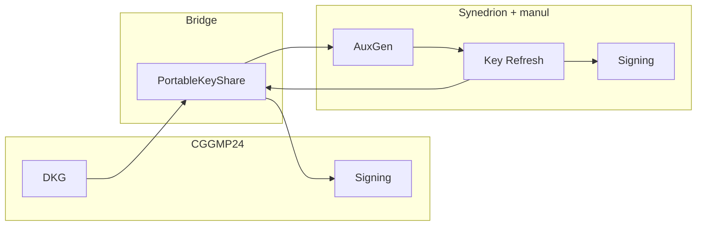

# 🔐 Threshold Key Bridge

> Bridge [CGGMP24](https://docs.rs/cggmp24)-style threshold key material to [Synedrion](https://github.com/entropyxyz/synedrion) for **key refresh**, then verify **end-to-end** on **Ethereum Sepolia** ⛓️

[](./Cargo.toml)

---

## TL;DR

- 🧩 Run **t-of-n DKG** with **`cggmp24`** (secp256k1).
- 🔄 **Convert** shares into a **portable** format and into **Synedrion** `KeyShare`s.
- 🔁 Run **Synedrion AuxGen** + **Key Refresh** (simulated via [`manul`](https://github.com/entropyxyz/manul)).
- ✍️ **Sign** on Sepolia with refreshed keys (Synedrion path), then **bridge back** to CGGMP and sign again — proving the **same address / public key** across the pipeline.

**Goal:** **Both [`cggmp24`](https://docs.rs/cggmp24) and [Synedrion](https://github.com/entropyxyz/synedrion) implement the CGGMP'24 line** (*UC Non-Interactive, Proactive, Threshold ECDSA with Identifiable Aborts*, Canetti et al.) — [IACR ePrint 2021/060](https://eprint.iacr.org/2021/060); they differ in **APIs, types, and shipped features**. This repo **bridges those gaps** so you can **use them together** in one pipeline (e.g. DKG/signing on one stack, **key refresh** where the other stack exposes it).

---

## Why this exists

### 🏛️ LFDT Lockness & the CGGMP line

The **[LFDT Lockness](https://github.com/LFDT-Lockness)** ecosystem (e.g. [`cggmp21`](https://github.com/LFDT-Lockness/cggmp21) / **`cggmp24`**) ships **audited**, production-oriented threshold ECDSA in Rust — attractive for **compliance** and security narratives.

The upstream **`cggmp24`** crate README explicitly lists what it **does not** support *yet*:

> This crate **does not** (currently) support:
> - Key refresh for both threshold (i.e., t-out-of-n) and non-threshold (i.e., n-out-of-n) keys  
> - Identifiable abort  

See the full README: [LFDT-Lockness/cggmp21](https://github.com/LFDT-Lockness/cggmp21) (source tree for `cggmp24`).

### ⚡ Synedrion

**[Synedrion](https://github.com/entropyxyz/synedrion)** (Entropy) implements MPC building blocks — including protocols you can use for **key refresh** and richer abort semantics — on top of the **`manul`** execution framework.

### Scope

- This repository **does not** vendor **Lockness** as a separate product; it depends on **`cggmp24`** + **`synedrion`** as shown in [`Cargo.toml`](./Cargo.toml).
- **Design:** keep **DKG / signing** on the **CGGMP24** side, run **Synedrion** for **refresh** in the middle, then **bridge back**.

---

## End-to-end flow 🪜

The flow lives in [`src/main.rs`](src/main.rs). Default parameters: **5 parties**, **3-of-5** threshold, **Sepolia** (`chain_id = 11155111`).

| Step | Phase | What happens |
|------|--------|----------------|
| 1 | **DKG + sanity tx** | Run **`cggmp24` DKG**. Derive the **Ethereum address** from the aggregate public key. Broadcast a **first** small-value tx on Sepolia using **CGGMP** signing — confirms the wallet matches DKG. |
| 2 | **Bridge → Synedrion** | Convert **`cggmp24` → `PortableKeyShare` → `synedrion::KeyShare`**. Run **Synedrion AuxGen** (cached under `data/synedrion_aux_gen.json`). Patch **`public`** share metadata if needed (see `main.rs`). Verify the **same ETH address** from the bridged aggregate key. |
| 3 | **Key refresh** | Run **Synedrion Key Refresh** (simulated; optional cache `data/refreshed_synedrion_shares.json`). Verify address again. |
| 4 | **Sign on Sepolia (Synedrion)** | Map **Shamir → additive** for a **t-party** subset (Lagrange / portable helpers in [`src/bridge/core.rs`](src/bridge/core.rs)). Run **Synedrion signing** simulation, broadcast a **second** tx. |
| 5 | **Bridge back + CGGMP tx** | **Synedrion → portable → `cggmp24`**, update template shares, run **CGGMP signing** again, broadcast a **third** tx. |

Constants such as **RPC URL**, **recipient address**, and **amounts** are hardcoded in `main.rs` — change them for your own wallet.

---

## Architecture (high level)



---

## Challenges 🧗

### Serialization & API surface

- Synedrion’s **`KeyShare`** is not always constructible from public helpers. **Earlier attempts** included **cloning** upstream and changing **`private` constructors / fields to `public`** so values could be built without serde — **the same objective** as the JSON approach below. This codebase builds JSON via `serde_json::json!` and deserializes instead — see [`src/bridge/synedrion.rs`](src/bridge/synedrion.rs) (`*bypass private constructor*` in comments).
- **Field names** (`"secret"`, `"public"`, etc.) are **serde-shape dependent**. Upstream renames or private layout changes **break** the bridge without compile-time help.
- **Forking** avoids JSON hacks but brings **fork maintenance**, **merge pain**, and **drift from audited releases** — here we stay on **serde** for portability.

### Cryptographic representation

- **Shamir** shares (typical in this CGGMP path) vs **additive** representations (used in parts of Synedrion signing flows) require **careful** local maps (e.g. **Lagrange** on a fixed signer set). Wrong **indices** or participant sets **desync** shares.

### Networking

- Live deployments need **authenticated channels**, **consistent session IDs**, and **agreement on participant sets**. This repository uses **manul**’s **local** simulated runner for protocol execution.

---

## Limitations & considerations

| Area | Note |
|------|------|
| **Dependencies** | Pinned **git** revs for `synedrion` / `manul`; optional **caches** under `data/`. |
| **Bridge** | Integration is **custom**; treat as **non-stable** relative to upstream crates. |
| **Compliance** | Even if Synedrion protocols offer **identifiable abort**, a **combined** stack only satisfies “end-to-end” properties if **every** layer and the **bridge** are in scope for review. |
| **Correctness** | Bugs in **conversion**, **aggregation**, or **nonce** handling can affect **who controls** derived keys — exercise care when adapting this code. |

---

## Requirements & running 🚀

- **Rust** (stable, 2021 edition)
- **Sepolia ETH** on the address derived from the DKG output — otherwise broadcasts **fail** (balance / nonce).

```bash
cargo build --release
cargo run --release
```

Edit [`src/main.rs`](src/main.rs) for:

- `rpc_url` — JSON-RPC endpoint  
- `to_address` — recipient  
- `chain_id` — e.g. `11155111` for Sepolia  

Cached files (if present):

- `data/synedrion_aux_gen.json` — Synedrion **AuxGen** output  
- `data/refreshed_synedrion_shares.json` — refreshed shares (see `force_refresh` in `main.rs`)  

---

## Dependencies (pinned)

| Crate | Role |
|------|------|
| [`cggmp24`](https://crates.io/crates/cggmp24) | DKG, CGGMP signing |
| [`synedrion`](https://github.com/entropyxyz/synedrion) (git rev in `Cargo.toml`) | Key refresh, signing |
| [`manul`](https://github.com/entropyxyz/manul) | Protocol execution |
| [`ethers`](https://crates.io/crates/ethers) | Ethereum txs & broadcast |

---

## Acknowledgements

- [LFDT Lockness](https://github.com/LFDT-Lockness) / CGGMP24 ecosystem  
- [Entropy](https://github.com/entropyxyz) — Synedrion & manul  
